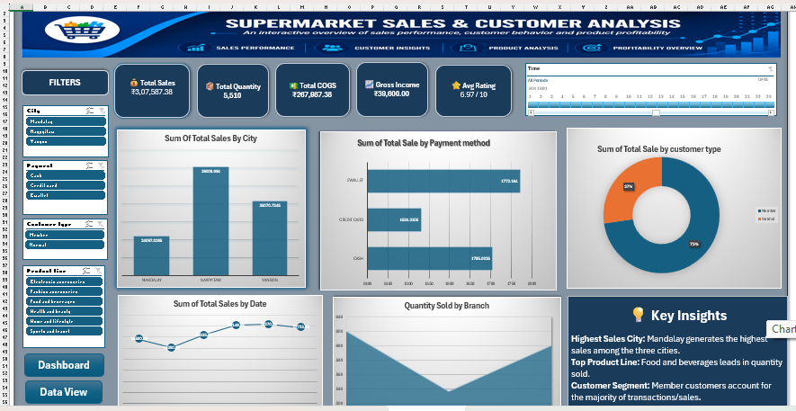

# 🛒 Supermarket Sales Dashboard – Excel

## 📊 Project Overview

The **Supermarket Sales Dashboard** is an interactive data analysis project created using **Microsoft Excel**.

The dashboard provides a clear overview of supermarket sales performance and helps analyze key business metrics such as **Total Sales, Total Profit, Product Line Performance, City-wise Sales, Customer Ratings, and Sales Trends**.

The main objective of this project is to transform raw supermarket sales data into meaningful and easy-to-understand business insights.

---

## 🎯 Objectives

- Analyze overall supermarket sales performance
- Track total sales and total profit
- Compare performance across different product lines
- Analyze city-wise sales performance
- Understand customer ratings
- Identify sales trends over time
- Create an interactive and visually appealing dashboard
- Present business insights in a simple and effective way

---

## 🛠️ Tools & Technologies

- **Microsoft Excel**
- Pivot Tables
- Pivot Charts
- Excel Formulas
- Data Cleaning
- Data Analysis
- Dashboard Design
- Data Visualization

---

## 📌 Key KPIs

The dashboard highlights important business metrics including:

- 💰 **Total Sales**
- 📈 **Total Profit**
- 🛍️ **Product Line Performance**
- 🏙️ **City-wise Sales**
- ⭐ **Customer Ratings**
- 📅 **Sales Trends**

---

## 📊 Dashboard Features

### 1. Sales Overview
Provides a quick summary of overall sales and profit performance.

### 2. Product Line Analysis
Compares sales and performance across different product categories.

### 3. City-wise Analysis
Shows how sales performance varies across different cities.

### 4. Customer Rating Analysis
Analyzes customer ratings to understand customer satisfaction and product performance.

### 5. Trend Analysis
Helps identify changes and patterns in sales performance over time.

### 6. Interactive Dashboard
The dashboard uses Excel-based visualizations and filters to make analysis more interactive and user-friendly.

---

## 💡 Key Insights

- Identifies the strongest and weakest performing product lines.
- Highlights cities contributing the most to overall sales.
- Provides an overview of profitability.
- Helps understand customer rating patterns.
- Makes it easier to identify sales trends and business opportunities.

---

## 📁 Project Files

| File | Description |
|------|-------------|
| `new supermarkets.xlsx` | Excel dataset and interactive Supermarket Sales Dashboard |

---

## 🖼️ Dashboard Preview

### 📊 Dashboard – Overview

### 📈 Detailed Analysis

---

## 🚀 Project Outcome

This project demonstrates my ability to:

- Clean and organize raw data
- Perform data analysis using Excel
- Create meaningful KPIs
- Build interactive dashboards
- Use data visualization techniques
- Convert raw data into actionable business insights

---

## 👩‍💻 Author

**Jyoti **

Aspiring Data Analyst | Excel | SQL | Power BI | Python

---

⭐ If you find this project useful, feel free to explore the repository.
